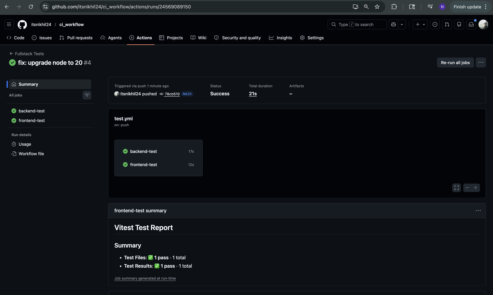
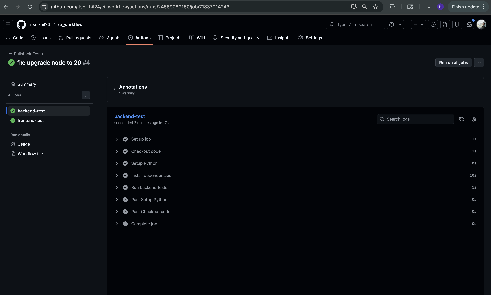
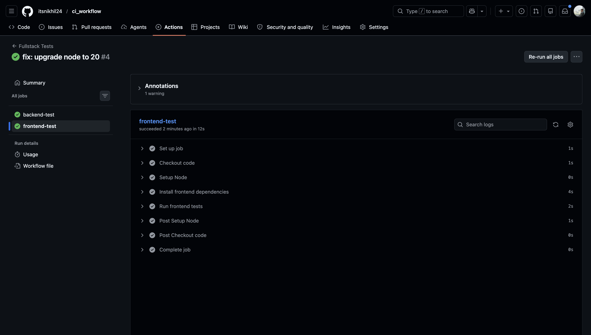

# ScreenShots

# Learning Outcomes
- Understood how to perform unit testing for backend APIs using pytest, including writing test cases and validating responses.
- Learned to test frontend components and forms using Vitest and React Testing Library, including simulating user interactions.
- Gained knowledge of running tests via CLI, ensuring both frontend and backend modules can be tested independently.
- Understood how to implement CI pipelines using GitHub Actions to automate testing on every code push.
- Learned best practices like using virtual environments (venv), managing dependencies, and handling test failures in CI/CD - workflows.

